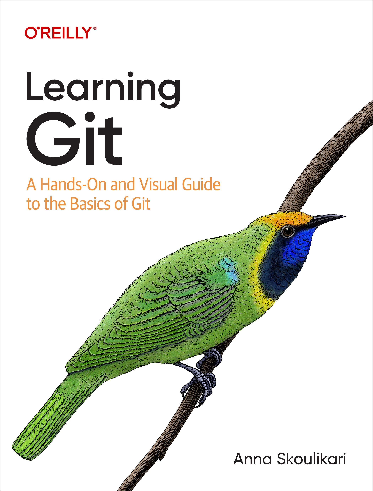

# Anna Skoulikari Creative Projects Documentation (Work In Progress)
Documentation for Creative Projects by Anna Skoulikari 

The below documentation is a curated list of creative projects by Anna Skoulikari in reverse chronological order. This is a constant work in progress and updated as Anna works on new creative projects. 

## 2024 

## 2023 

### Book - [Learning Git: A Hands-On and Visual Guide to the Basics of Git](https://www.amazon.com/Learning-Git-Hands-Visual-Basics/dp/1098133919) 

