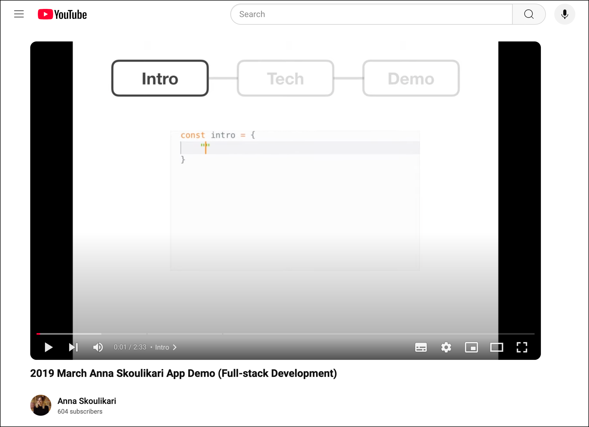

# Anna Skoulikari Creative Projects Documentation (Work In Progress)

Just like [Seth Godin, I have mainly viewed my life as a series of creative projects](https://seths.blog/2014/07/thirty-years-of-projects/).

Here is a curated list of creative projects by me, Anna Skoulikari, in reverse chronological order which will be updated as I go along. 

> For broken links or any other feedback, reach out at annaskoulikari@gmail.com ☀️

## 2024 

### Book trailer - [Learning Git Book Trailer video](https://www.youtube.com/watch?v=GAbERXgwzwU)

More than a year after my first book (Learning Git) was published, I finally go around to partnering with a videographer [Ieva Galginaite (IGV Productions)](https://www.igvproductions.com/) and making a fun and playful trailer for it. 

I wrote the script which used a cooking metaphor, bought the props, and we got together in the studio to shoot.

## 2023 

### Book - [Learning Git: A Hands-On and Visual Guide to the Basics of Git](https://www.amazon.com/Learning-Git-Hands-Visual-Basics/dp/1098133919) 

For two years, I worked on writing a book teaching the basics of Git using the colors of the rainbow, visuals, hands-on exericses, and storytelling. 

## 2020 

### Online course - [Git for Complete Beginners: A Visual Learning Journey for the Basics of Git](https://learning.oreilly.com/course/git-for-complete/0642572059965/)

An online course teaching the basics of Git. It's initial home was the Udemy (an online course platform) and in August of 2024 it moved to the O'Reilly online learning platform. 

## 2019 Web developer job search journey 

I approach all of my job searches like mini creative projects. Since I explore careers like an anthropologist, I have a lot of job search journeys. 

In my web developer job search journey, I chose to use the power of the video medium and [made a video showcasing the project I had built whle attending a coding bootcamp](https://www.youtube.com/watch?v=iWesF6zGkWo).

## 2018 UX designer job search journey 

My UX job search journey took place in London after I had completed a 3 month intensive UX design bootcamp. My creative problem was how to stand out amongst tons of other brilliant junior UX designers in London. So I decided to create [a video CV](https://youtu.be/HkIIrJKXZl0) rather than just relying on a regular A4 PDF CV. And I wrote in-depth case studies for the three ([1](https://medium.com/anna-skoulikari/project-1-deki-and-the-mobile-app-in-depth-case-study-c7bca4eca76c) [2](https://medium.com/anna-skoulikari/project-2-palmersville-training-and-the-responsive-website-in-depth-case-study-62adc1704d0d) [3](https://medium.com/anna-skoulikari/project-3-funky-spaces-and-the-website-optimisation-in-depth-case-study-6c0296be9f80)) hands-on projects I had worked on while at the bootcamp and posted them on Medium

